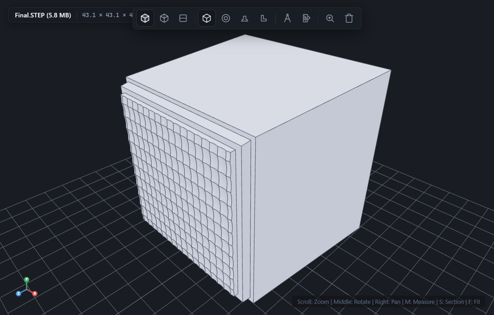
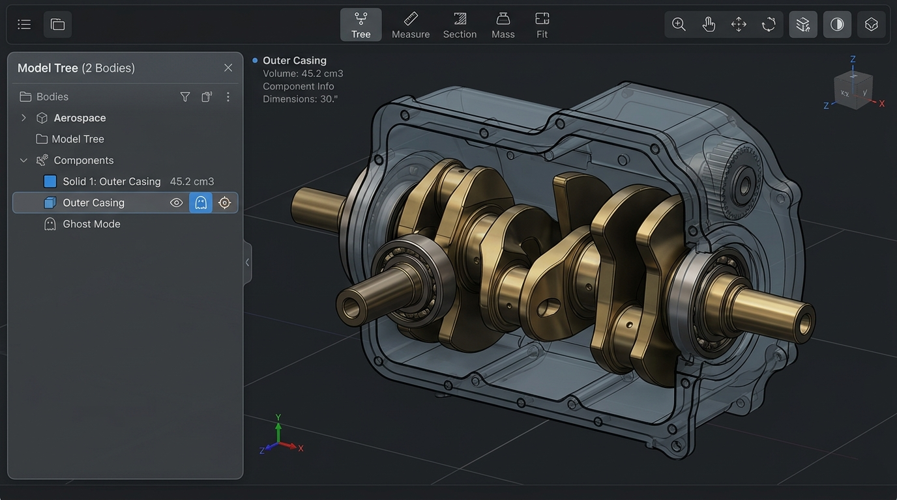
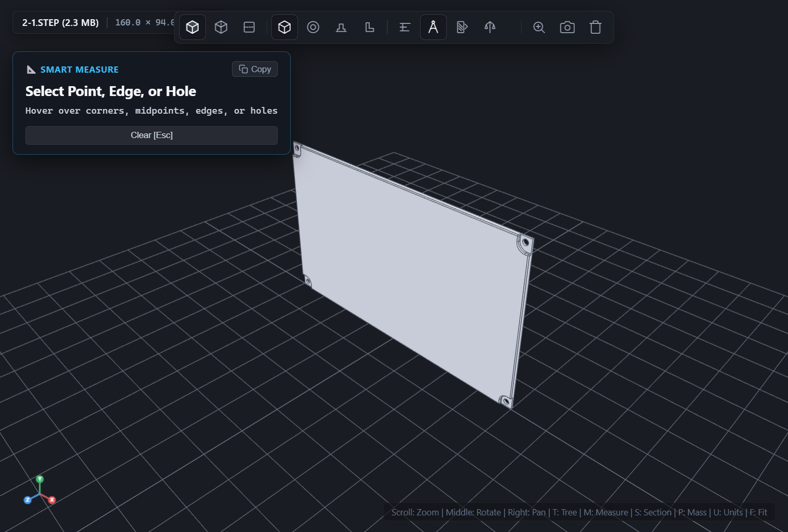
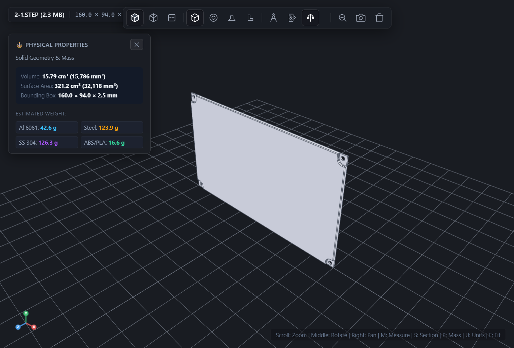

# QuickLook.Plugin.StepViewer 🚀

> **Instant, Zero-Lag 3D CAD Preview for STEP / STP Files directly in Windows Explorer.**  
> Built for [QuickLook](https://github.com/QL-Win/QuickLook) — just highlight any `.step` or `.stp` file and tap **Spacebar**.

[](LICENSE)
[](https://github.com/QL-Win/QuickLook)
[](https://dotnet.microsoft.com/)
[-orange?style=flat-square)](https://github.com/donalffons/opencascade.js)
[](https://threejs.org/)

---



---

## ✨ Features at a Glance

* ⚡ **Spacebar Instant CAD Inspection:** Zero wait time, zero software bloat. Tap Spacebar on any STEP file in Windows Explorer for a silky-smooth, 60 FPS 3D CAD inspection window.
* 📐 **Smart CAD Measure Tool (`M` key):**
  * **Intelligent Geometric Snapping:** Instantly snaps to vertices, edge midpoints, and circular hole centers.
  * **Direct Feature Dimensions:** Hover or click to read linear edge lengths, circular hole diameters ($\varnothing$) / radii ($R$), and planar face surface areas.
  * **3D Delta Distance:** Click any two points, edges, or hole centers to inspect Euclidean 3D distance and Cartesian $(\Delta X, \Delta Y, \Delta Z)$ components with automatic leader dimension lines.
  * **Dual Units:** Live one-touch toggle between Metric ($\text{mm}, \text{mm}^2, \text{cm}^3$) and Imperial ($\text{in}, \text{in}^2, \text{in}^3$) via the `U` key.
* 🌳 **Model Tree & Multi-Body Assembly Panel (`T` key):**
  * Explore individual solid bodies and underlying B-Rep topological faces.
  * **Interactive 3D Hover & Focus:** Hover over any body in the tree to light it up in the viewport; click to smoothly animate camera zoom and focus on it.
  * **Isolate Mode (`I`):** Solo inspection of complex internal parts in multi-body models.
  * **Ghost / X-Ray Mode (`G`):** Semi-transparent silhouette mode to see inside assemblies without hiding geometry.
  * **Body Visibility (`V`):** Toggle individual solid bodies on and off.
* 🔬 **SolidWorks-Grade HLR Edge Rendering:**
  * Clean, crisp mechanical crease outlines matching professional engineering CAD software.
  * **Tangent Blend Suppression:** Automatically eliminates distracting mesh seams and circular blend lines on fillets.
  * **Parametric Seam Elimination:** No stray discretization lines on spherical domes or cylindrical faces.
* ⚖️ **Mass Properties & Material Calculator (`P` key):**
  * Calculates real CAD volume and surface area.
  * Live weight calculation with built-in material density presets: *Structural Steel*, *6061 Aluminum*, *Brass*, *Grade 5 Titanium*, *ABS Plastic*, *Delrin (POM)*, and *Acrylic*.
* 🎨 **Studio Graphite Dark Aesthetic:** Premium dark glassmorphic interface designed for mechanical engineers and 3D designers.

---

## 📸 Visual Showcase

| Multi-Body Assembly Tree (`T`) | Smart Snapping & Pitch Measurement (`M`) |
| :---: | :---: |
|  |  |

| Mass Properties & Material Density (`P`) | Metric & Imperial Live Toggle (`U`) |
| :---: | :---: |
|  |  |

---

## 📥 Installation

### Method 1: The QuickLook Way (Recommended)
1. Download the latest `QuickLook.Plugin.StepViewer.qlplugin` from the **[Releases](https://github.com/Mostafa214/QuickLook.Plugin.StepViewer/releases)** page.
2. In Windows Explorer, select the downloaded `.qlplugin` file and press **Spacebar**.
3. QuickLook will automatically ask to install the plugin. Click **Install**.
4. Restart QuickLook (or right-click the QuickLook icon in your system tray and select **Restart**).

### Method 2: Manual Installation
1. Download `QuickLook.Plugin.StepViewer.qlplugin` and rename the extension from `.qlplugin` to `.zip`.
2. Extract the folder into your QuickLook plugin directory:
   * **Installer / Portable version:**  
     `%APPDATA%\pooi.moe\QuickLook\QuickLook.Plugin\QuickLook.Plugin.StepViewer\`
   * **Microsoft Store version:**  
     `%LOCALAPPDATA%\Packages\21090PaddyXu.QuickLook_egxr34yet59cg\LocalCache\Roaming\pooi.moe\QuickLook\QuickLook.Plugin\QuickLook.Plugin.StepViewer\`
3. Restart QuickLook.

---

## ⌨️ Keyboard Shortcuts & Controls

| Shortcut / Input | Action |
| :--- | :--- |
| **Spacebar** | Open / Close QuickLook CAD preview |
| **Left Click + Drag** | Orbit / Rotate model 3D camera |
| **Right Click + Drag** | Pan 3D camera |
| **Mouse Scroll Wheel** | Zoom In / Out |
| **`M`** | Toggle Smart Measure Tool |
| **`T`** | Toggle Model Tree / Multi-Body Assembly Panel |
| **`P`** | Toggle Mass Properties & Material Weight Inspector |
| **`U`** | Switch Units between Metric (mm) and Imperial (inches) |
| **`I`** | Isolate currently active body (in Tree Panel) |
| **`G`** | Toggle Ghost / X-Ray transparency on active body |
| **`V`** | Toggle active body visibility |
| **`Esc`** | Deselect active face / body, clear measurements, or close modal panels |

---

## 🛠️ Building from Source

### Prerequisites
* Windows 10 / 11
* [.NET Framework 4.8 Developer Pack](https://dotnet.microsoft.com/download/dotnet-framework/net48)
* [PowerShell 5.1+](https://learn.microsoft.com/powershell/)
* [QuickLook](https://github.com/QL-Win/QuickLook) installed

### Build & Package
Clone the repository and run the packaging automation script:

```powershell
git clone https://github.com/Mostafa214/QuickLook.Plugin.StepViewer.git
cd QuickLook.Plugin.StepViewer

# Clean compile, package .qlplugin, install to local QuickLook, and restart:
powershell -ExecutionPolicy Bypass -File .\pack-plugin.ps1 -Install -RestartQuickLook
```

The compiled package will be generated at `./QuickLook.Plugin.StepViewer.qlplugin`.

---

## 🏗️ Architecture & Technology Stack

```
Windows Explorer (Spacebar)
       │
       ▼
QuickLook Host Process
       │
       ▼
QuickLook.Plugin.StepViewer (C# .NET 4.8 / WPF)
       │
       ▼ Microsoft Edge WebView2 (Chromium Embedded)
┌────────────────────────────────────────────────────────┐
│ viewer.html + Three.js r128                            │
│  ├── 60 FPS OrbitControls & Studio Graphite Viewport   │
│  ├── Interactive Smart Measure Raycaster Engine        │
│  └── Multi-Body B-Rep Tree Hierarchy                   │
└──────────────────────────┬─────────────────────────────┘
                           │ Web Worker Message Channel
                           ▼
┌────────────────────────────────────────────────────────┐
│ stepWorker.js (Dedicated Background Worker)            │
│  ├── OpenCASCADE.js (WebAssembly CAD Kernel)           │
│  ├── Multi-Body B-Rep Topology Extractor               │
│  ├── SolidWorks HLR Tangent & Silhouette Filter        │
│  └── IndexedDB Geometry Caching System                 │
└────────────────────────────────────────────────────────┘
```

---

## 📄 License

This project is licensed under the [MIT License](LICENSE) — see the [LICENSE](LICENSE) file for details.

Developed with ❤️ for the 3D CAD & engineering community by **[Mostafa Azimi](https://github.com/Mostafa214)**.
